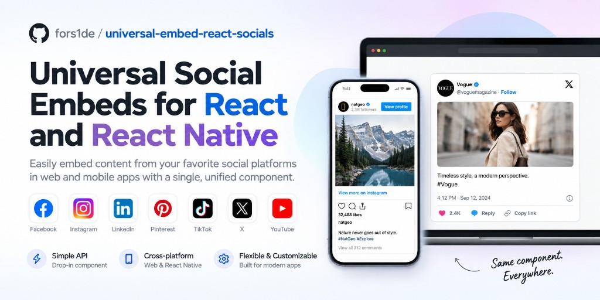

# @fors1de/universal-embed-react-socials

[npm](https://www.npmjs.com/package/@fors1de/universal-embed-react-socials)



Embed posts from Facebook, Instagram, LinkedIn, Pinterest, TikTok, X (Twitter), and YouTube in **React** and **React Native**. Configurable platform API versions available.

On web, embeds use the official platform scripts and iframes. On React Native, paired `.native` files render a `WebView` (`react-native-webview`).

## Install

```bash
npm i @fors1de/universal-embed-react-socials
```

React Native also needs:

```bash
npm i react-native-webview
```

TikTok in-app link handling parses URLs without `URL.searchParams`, so `react-native-url-polyfill` is not required.

## Usage

On web, embeds are `width: 100%` of their container by default. Pass `maxWidth` only when you want a cap.

```jsx
import { FacebookEmbed, InstagramEmbed } from '@fors1de/universal-embed-react-socials';

<FacebookEmbed
  url="https://www.facebook.com/andrewismusic/posts/451971596293956"
  apiVersion="v26.0"
/>

<InstagramEmbed
  url="https://www.instagram.com/p/CUbHfhpswxt/"
  apiVersion="14"
  captioned
/>
```

### Facebook

```jsx
import { FacebookEmbed } from "@fors1de/universal-embed-react-socials";

<FacebookEmbed
  url="https://www.facebook.com/andrewismusic/posts/451971596293956"
  apiVersion="v26.0"
  locale="en_US"
/>;
```

`apiVersion` accepts `v26.0`, `26.0`, `v26`, or `26`. Default is `v26.0` (current Graph API).

### Instagram

```jsx
import { InstagramEmbed } from "@fors1de/universal-embed-react-socials";

<InstagramEmbed
  url="https://www.instagram.com/p/CUbHfhpswxt/"
  apiVersion="14"
  captioned
/>;
```

`apiVersion` maps to Instagram's `data-instgrm-version`.

### LinkedIn

```jsx
import { LinkedInEmbed } from "@fors1de/universal-embed-react-socials";

<LinkedInEmbed
  url="https://www.linkedin.com/embed/feed/update/urn:li:share:6898694772484112384"
  postUrl="https://www.linkedin.com/posts/peterdiamandis_5-discoveries-the-james-webb-telescope-will-activity-6898694773406875648-z-D7"
  height={570}
/>;
```

Use the `src` from LinkedIn's "Embed this post" iframe.

### Pinterest

```jsx
import { PinterestEmbed } from "@fors1de/universal-embed-react-socials";

<PinterestEmbed url="https://www.pinterest.com/pin/99360735500167749/" />;
```

### TikTok

```jsx
import { TikTokEmbed } from "@fors1de/universal-embed-react-socials";

<TikTokEmbed url="https://www.tiktok.com/@epicgardening/video/7055411162212633903" />;
```

Set `allowsFullscreenVideo` or pass `tikTokProps` to use TikTok's Embed Player.
On React Native, with `openLinksInBrowser` enabled (the default), the player's
app-opening redirects open the original HTTPS post URL. This avoids sending
Safari through an app-install link when tapping the TikTok logo.

### X (Twitter)

```jsx
import { XEmbed } from "@fors1de/universal-embed-react-socials";

<XEmbed url="https://twitter.com/PixelAndBracket/status/1356633038717923333" />;
```

X's official widget is 550px wide. A numeric `maxWidth` is capped at 550; a percentage or CSS length (`"50%"`, `"400px"`) is used as given.

Widget chrome (Like, Reply, Copy link) follows the browser language on web and the device language on React Native. Pass `locale` to override (`en`, `de`, `ja`, `zh-cn`, or `en_US`).

`TwitterEmbed` is still exported as a deprecated alias of `XEmbed`.

### YouTube

```jsx
import { YouTubeEmbed } from "@fors1de/universal-embed-react-socials";

<YouTubeEmbed url="https://www.youtube.com/watch?v=HpVOs5imUN0" />;
```

Shorts (`youtube.com/shorts/ID`) and `youtu.be` links work. Extra player options go through `youTubeProps.opts.playerVars`. Start time is read from `start=` or `t=` (`90`, `90s`, `1m30s`).

## React vs React Native

Platform-specific code lives in paired `.web.tsx` and `.native.tsx` files. Metro picks the native files; the web build flattens `.web` files for React DOM. Native embeds use `View` and `WebView` JSX.

You do not need `react-native` installed for a web-only app. Web embeds fill the parent at `100%` width by default; pass `maxWidth` to cap them. On React Native, omit `height` to size from the embed when the platform reports it.

On React Native, tapped embed links open in the system browser by default. Pass `openLinksInBrowser={false}` to keep navigation inside the WebView.

```jsx
<YouTubeEmbed
  url="https://www.youtube.com/watch?v=HpVOs5imUN0"
  openLinksInBrowser
/>
```

Pass extra `react-native-webview` options with `webViewProps` (ignored on web). `source` is owned by the embed. Navigation, open-window, load, error, and crash-recovery handlers are composed so your callback still runs. `setSupportMultipleWindows` defaults from `openLinksInBrowser` when omitted.

```jsx
<FacebookEmbed
  url="https://www.facebook.com/andrewismusic/posts/451971596293956"
  height={372}
  webViewProps={{
    allowsInlineMediaPlayback: true,
    userAgent: 'custom-ua',
    onMessage: (event) => console.log(event.nativeEvent.data),
  }}
/>
```

## Shared embed props

Every embed accepts:

- `url`
- `maxWidth` / `height` — On web, omit `maxWidth` to fill the container (`100%`). Pass a pixel or percent value to cap it. Omit `height` to size the embed from the platform when it reports it.
- `placeholderText` — text on the default placeholder.
- `placeholder` — custom loading UI. Replaces the default placeholder. Pass `null` or `() => null` to render nothing and reserve no height until the embed is ready.
- `placeholderWidth` / `placeholderHeight` / `placeholderStyle` — optional overrides. By default the placeholder matches the embed size, or the provider’s default size before the embed has measured.
- `placeholderImageUrl` / `placeholderSpinner` / `placeholderSpinnerDisabled` / `placeholderProps`
- `placeholderProps.imageAlt` — alt text for `placeholderImageUrl`. Defaults to empty (decorative); the placeholder control is named by `placeholderText`.
- `iframeTitle` — accessible name for the embed iframe (web) or WebView (React Native). Defaults to `{provider} embed {id}` so two YouTube embeds on one page are not both named “YouTube embed”.
- `placeholderDisabled` — hide the placeholder.
- `embedDisabled` — keep the placeholder and do not load the live embed (iframe, WebView, or provider scripts) until this is `false`.
- `lazy` — wait until the embed is near the viewport before loading provider scripts or a WebView. Default `false` (load immediately, same as before).
- `className` / `style`
- `id` / `testID` — forwarded to the embed root (`data-testid` on web, `testID` / `nativeID` on React Native).
- `webViewProps` (React Native only)
- `openLinksInBrowser` (React Native only) — open tapped embed links in the system browser. Defaults to `true`. Ignored on web.
- `iframeSandbox` (web only) — opt-in iframe `sandbox` for Facebook and Pinterest `blob:` embeds. See [Trust boundaries](#trust-boundaries).
- `onError` — called once if the embed cannot load (`timeout`, `script-missing`, `unavailable`, `invalid-url`, or native `load-failed`). Deleted iframe posts often still load an error page, so they may not fire.

Provider-specific:

- `postUrl` — LinkedIn and Pinterest. Canonical post URL used as the placeholder target when it differs from the embed `url`.
- `captioned` — Instagram. Request the captioned embed layout.
- `apiVersion` — Facebook Graph / JS SDK version, or Instagram `data-instgrm-version`.
- `locale` — Facebook SDK locale (for example `en_US`). X (Twitter) widget chrome locale; defaults to the browser language on web and the device language on React Native (`en`, `de`, `ja`, `zh-cn`, or `en_US`).
- `allowsFullscreenVideo` — TikTok. Use the Embed Player so fullscreen stays in-app. Also accepted on native WebViews.

`parseEmbedHeight` works on web and native. `useAutoEmbedHeight` is web-only; on React Native it is a no-op because auto-height is handled inside the embed WebView.

```jsx
<InstagramEmbed
  url="https://www.instagram.com/p/CUbHfhpswxt/"
  embedDisabled
/>
```

Set `embedDisabled={false}` (or omit it) when you want the live post to load.

Opt in to near-viewport loading with `lazy` (default is off, so embeds still load immediately):

```jsx
<InstagramEmbed
  url="https://www.instagram.com/p/CUbHfhpswxt/"
  lazy
/>
```

Instagram and TikTok on **web** also support `scriptLoadDisabled`, `retryDelay`, `retryDisabled`, `frame`, and `debug`. Those props are ignored on React Native.

## Trust boundaries

Facebook and Pinterest on web load provider HTML through a `blob:` iframe so the library can measure height (`contentDocument` on Facebook; `postMessage` on Pinterest). A `blob:` URL inherits **this page's origin**, so those provider scripts can read `document.cookie`, `localStorage`, and `parent.document`. Official `facebook.com` / `pinterest.com` iframes cannot.

This is unchanged by default so auto-height keeps working. Opt into a restrictive sandbox (no `allow-same-origin`) when the host page has credentials the widget should not see:

```jsx
<FacebookEmbed
  url="https://www.facebook.com/andrewismusic/posts/451971596293956"
  iframeSandbox
/>

<PinterestEmbed
  url="https://www.pinterest.com/pin/99360735500167749/"
  iframeSandbox
/>
```

`iframeSandbox` (or a custom token string) applies only to those blob iframes. Facebook then uses the official plugin iframe instead. Pinterest keeps the blob iframe; height still arrives via `postMessage`.

Instagram, TikTok (oEmbed card), and X inject the provider script into **the host document**, which is also same-origin with your app. YouTube, LinkedIn, and the TikTok player use cross-origin `https:` iframes.

On React Native, embeds run in a WebView. Tapped links open in the system browser by default (`openLinksInBrowser`).

Report vulnerabilities privately — see [SECURITY.md](./SECURITY.md). Do not file them on the public issue tracker.

## API version helpers

```ts
import {
  DEFAULT_FACEBOOK_API_VERSION,
  DEFAULT_INSTAGRAM_API_VERSION,
  DEFAULT_WEB_EMBED_WIDTH,
  normalizeFacebookApiVersion,
  getFacebookSdkSrc,
} from "@fors1de/universal-embed-react-socials";
```

## License

MIT
